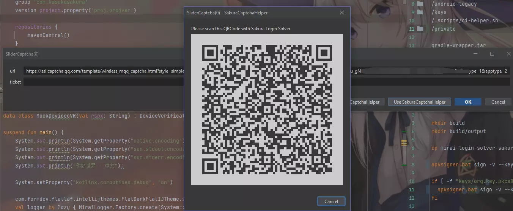
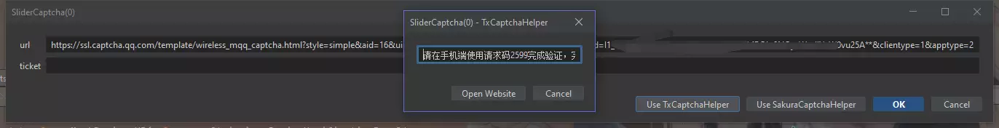
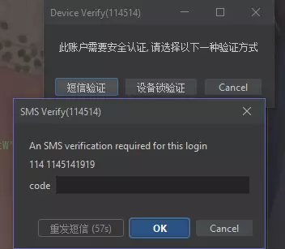
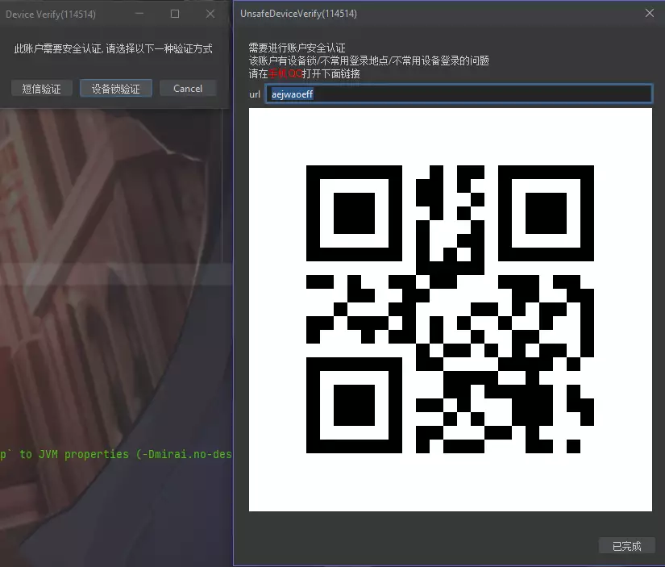
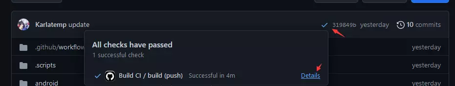
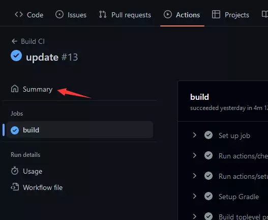
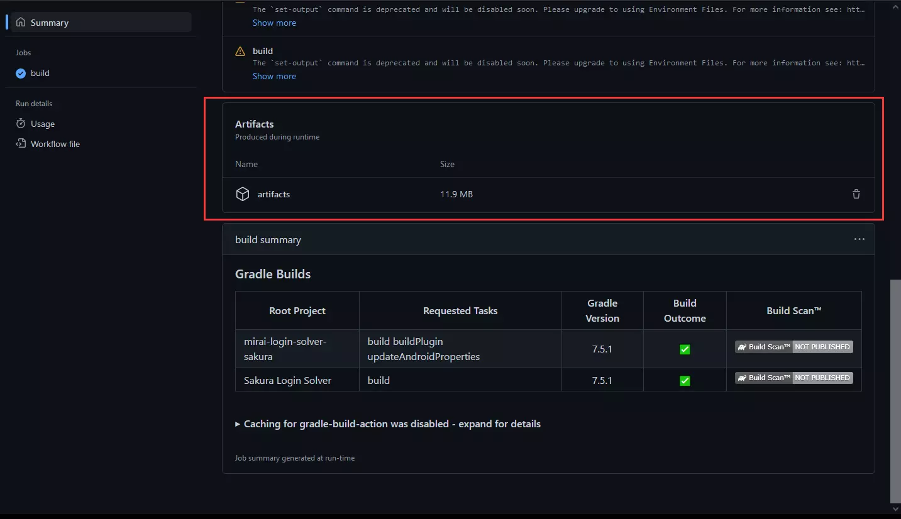

# mirai-login-solver-sakura

--------------------------

这是另外的一整套验证处理工具，主要是为了优化和方便处理各种验证码

> 本项目前身: [TxCaptchaHelper](https://github.com/mzdluo123/TxCaptchaHelper)

本项目提供的不是扫码登录，只是利用扫码简化交互流程  
在服务器上验证请阅读 [#配置](#配置)  

本项目只负责验证过程中数据的传递  
`net.mamoe.mirai.network` 相关异常请汇报至 [mamoe/mirai](https://github.com/mamoe/mirai/issues)

## 系统要求

| mirai-login-solver-sakura | mirai-core | Android             |
|:--------------------------|:-----------|:--------------------|
| 0.0.10 - dev              | 2.15.0+    | Android 9+ (API 28) |
| 0.0.1 - 0.0.9             | 2.13.0+    | Android 9+ (API 28) |

--------------

### 已完成 / 计划

- [X] GUI (Graphics User Interface)
- [ ] CLI (Command Line Interface)

#### GUI

- [X] SMS
- [X] 设备锁验证
- [X] 滑块验证
- [X] Pic 4code 验证

###### 预览

<details>
<summary>点击展开</summary>









</details>

### 下载

Way 1:
从 [Releases](https://github.com/KasukuSakura/mirai-login-solver-sakura/releases)
下载

- `mirai-login-solver-sakura-XXX.mirai2.jar` -> mirai-console 插件
- `apk-release.apk` 安卓应用程序

Way 2: 从最新构建下载

<details>
<summary>点击展开</summary>







下载的压缩包里有全部的最新构建成果

</details>


## 配置

mirai-login-solver-sakura 配置通过 jvm 参数指定

| property                  | default | accepts    | desc                             |
|:--------------------------|:--------|:-----------|:---------------------------------|
| mlss.no-tunnel            | false   | true/false | 是否禁用 tunnel                      |
| mlss.port                 | 0       | 0-65536    | mlss 后端端口号                       |
| mlss.tunnel.limited       | true    | true/false | 是否启动安全策略限制 tunnel 链接             |

为了方便在云服务器上的使用（避免重复设置端口防火墙）  
当 `mlss.port` 取 `0` 时，将先尝试绑定端口 `22333`,   
如果端口 `22333` 无法使用，则使用随机端口

## Q & A

> Q: 扫码后崩溃 <br/>
> A: 更新 `Android WebView`, 具体方法请百度 `Android 更新 WebView`

> Q: 怎么在服务器上验证 <br/>
> A: 使用命令行模式 (添加 jvm 参数 `-Dmirai.no-desktop=true`)

> Q: No any server availalbe <br/>
> A: 云服务器检查防火墙 <br/>
> A: WIFI局域网则检查路由器的AP隔离，可以尝试在本机上 ping 一下自身的 ip，刷新路由表

---------

> 以下内容只适合需要对接 mirai-login-solver-sakura 的开发者参考
## 数据交换

### `<QR CODE>`

显示给 APP 扫描的二维码内容是一个 json, 格式如下

```json5
{
    "port": 8080, // 数据交换的 http 服务器的端口
    "server": [   // 全部可能的 ip 地址 (内网)
        "192.168.2.123",
        "192.168.5.148",
    ],
    "id": "AAAAAAAAAAAAAAA", // 本次请求的 id
}
```

### `/request/request/$id`

```json5
{
    "reqid": "AAAAAAAAAAAAAA", // 请求的 id  (not in use)
    "rspuri": "/request/complete/AAAAAAAAAAAAAA", // 回调, 只有 path, POST 请求, 无编码
    "create-time": 10086, // 时间戳, ms      (not in use)
    "data": { // 请求的数据体
        "type": "slider", // 这次请求的类型
        //..... 请求的其他数据
    },

    // 代理地址, 可选 (可不提供), 占位符 <serverip> 会自动替换为合适的地址, 支持 socks5 和 http proxy
    "tunnel": "socks://<serverip>:1234", // Optional
}
```

#### `slider`

REQ

```json5
{
    "data": {
        "type": "slider",
        "url": "https://ssl.captcha.qq.com/template/wireless_mqq_captcha.html?style=simple&aid=16&uin=.....",
    }
}
```

RSP:

```text
t105.............
```

#### `browser`

打开链接
```json5
{
  "data": {
    "type": "browser",
    "url": "https://www.baidu.com"
  }
}
```

RSP: `Not available`
